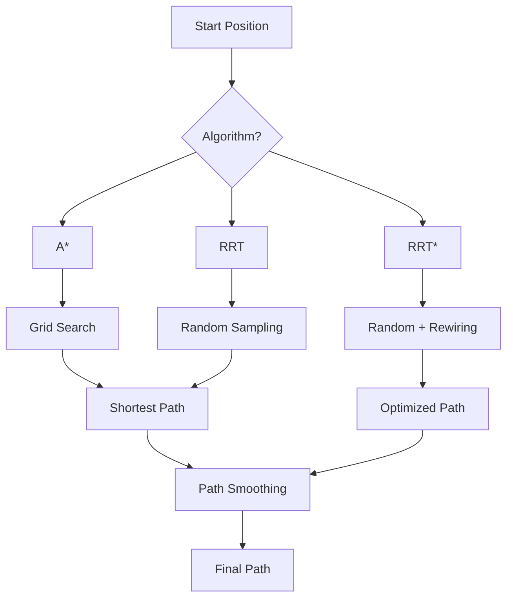

# AutonomousUAV

**Path Planning and Obstacle Avoidance for Autonomous Drone Navigation**

[](https://www.python.org/)
[](LICENSE)
[](https://github.com/mehmetd7mir/AutonomousUAV/actions)

> Implements A*, RRT, and RRT* algorithms for autonomous UAV path planning with obstacle avoidance.

---

## Features

- **A\* Pathfinding** on grid maps with configurable resolution
- **RRT** (Rapidly-exploring Random Tree) for continuous space
- **RRT\*** with path optimization through tree rewiring
- Random and manual obstacle generation
- Path smoothing to reduce unnecessary waypoints
- Environment visualization with Matplotlib
- Path animation showing UAV movement

## Algorithms



| Algorithm | Space | Optimal | Speed | Use Case |
|-----------|-------|---------|-------|----------|
| **A\*** | Grid | Yes | Fast | Known environments |
| **RRT** | Continuous | No | Medium | Unknown, complex spaces |
| **RRT\*** | Continuous | Asymptotically | Slower | When path quality matters |

## Quick Start

```bash
# install dependencies
pip install -r requirements.txt

# run full demo (both algorithms)
python main.py --demo

# run A* only
python main.py --algorithm astar --visualize

# run RRT only
python main.py --algorithm rrt --visualize

# custom grid size
python main.py --algorithm astar --grid-size 100 --visualize
```

## Project Structure

```
AutonomousUAV/
├── main.py                     # entry point
├── src/
│   ├── planning/
│   │   ├── astar.py                   # A* algorithm
│   │   └── rrt.py                     # RRT and RRT* algorithms
│   └── simulation/
│       └── environment.py             # 2D environment simulation
├── tests/                      # unit tests
├── docs/                       # documentation
└── .github/workflows/          # CI pipeline
```

## Running Tests

```bash
pip install pytest
pytest tests/ -v
```

## Tech Stack

| Component | Technology |
|-----------|------------|
| **Path Planning** | Custom A*, RRT, RRT* |
| **Computation** | NumPy, SciPy |
| **Visualization** | Matplotlib, Pygame |
| **Testing** | pytest |

## How A* Works

1. Start from initial position on grid
2. Expand node with lowest `f(n) = g(n) + h(n)`
   - `g(n)` = cost from start to current node
   - `h(n)` = heuristic estimate to goal (Euclidean distance)
3. Check all neighbors, add new paths to open set
4. Repeat until goal is reached or no path exists
5. Post-process: smooth path to reduce waypoints

## How RRT Works

1. Sample random point in environment
2. Find nearest existing tree node
3. Steer toward random point (limited by step size)
4. Check for collisions along the way
5. Add new node to tree if collision-free
6. Repeat until goal region is reached

## Author

**Mehmet Demir** - [GitHub](https://github.com/mehmetd7mir)
